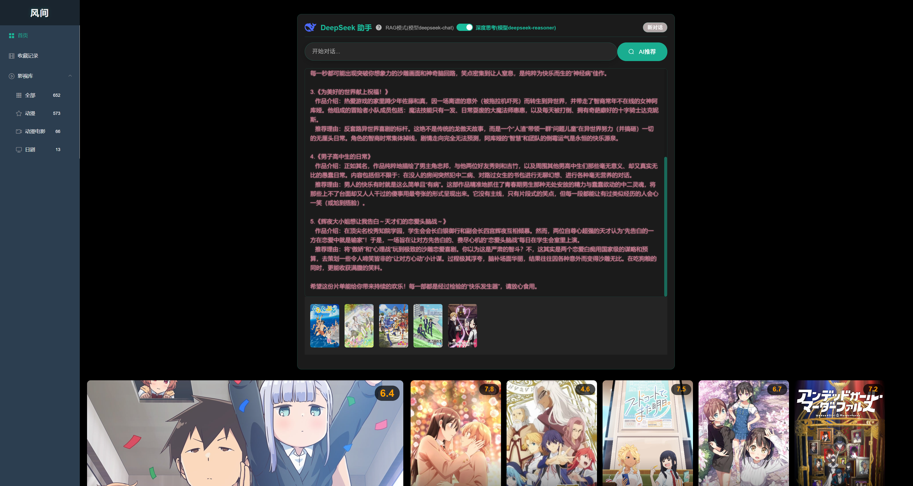
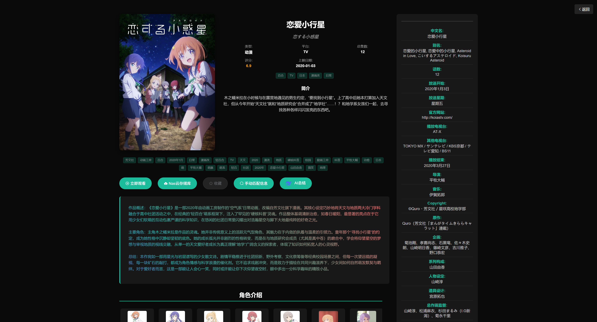

# 风间 - 智能动漫推荐平台

**在线访问**：https://www.hoxise.cn

## 🎯 项目简介
一个使用LLM的智能动漫推荐系统。通过集成大语言模型与本地动漫知识库，解决传统推荐系统灵活性差、信息滞后的问题，为用户提供个性化、高准确率的对话式推荐体验。

## ✨ 核心功能
- **智能对话推荐**：通过自然语言交互，理解用户偏好并推荐动漫。
- **RAG模式生成**：结合本地数据库，为动漫生成准确的内容总结。
- **影视库管理**：自动化扫描、匹配与展示本地影视资源元数据。

## 🛠 技术栈
| 类别         | 技术选型                                                                                        |
|:-----------|:--------------------------------------------------------------------------------------------|
| **后端**     | JDK 17, Spring Boot 3.5.9, **Spring AI**, Redis Stack (向量检索), MySQL, MyBatis-Plus, Sa-token |
| **前端**     | Vue 2, Element UI                                                                           |
| **AI与数据**  | DeepSeek API, Qwen向量模型， Bangumi元数据                                                          |
| **运维与云服务** | Docker, Nginx, 阿里云 (ECS/OSS/短信), OSS可切换MinIO                                                |

  
  
  
  

## 📁 项目架构

| 项目              | 说明   |
|-----------------|------|
| `hoxise-api`    | 打包层  |
| `hoxise-common` | 通用模块 |
| `hoxise-self`   | 功能模块 |
| `hoxise-system` | 系统服务端 |

## 📄 说明
本项目为个人作品，代码仅供参考学习。